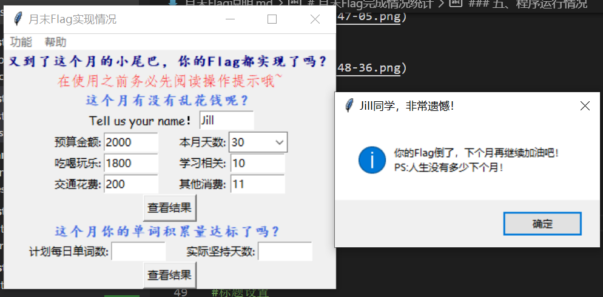

# 月末Flag完成情况统计 #
### 一、概况 ###
> **主要功能：** 用于帮助用户统计一个月之内的消费和单词背诵数，并且自动与预期比较，生成结果和报告来使用户对自己本月情况有清晰的认识。

> **使用说明：** （1）用户需要按照窗口提示输入自己的姓名或昵称，输入自己各项的消费金额以及月初预算，输入自己计划每天背单词数以及实际坚持的天数 （2） 可以在下拉菜单中得到操作提示

> **选项：** “退出”，“保存并生成报告”，“查看历史纪录”，“关于”，“操作提示”

### 二、程序组成 ### 

* 程序由用户类，GUI主窗口，GUI跳转窗口三部分组成

### 三、附加功能 ###

* 保存并查看历史记录——用户可以看到之前几个月消费以及记单词情况，来相互比较：对于之前注册过的用户，只要再次输入同样的用户名便可获取。

* 历史记录及时更新——用于在得到本月报告之后想要直接与历史记录对比的用户：在用户生成报告之后即可直接查看刷新后的历史记录，不需要重新运行程序。

* 记录刷新——对用户的容错性：如果用户发现自己上一次输错了，重新输入正确的数据并保存后可以自动更新之前的报告，以最后一次输入的结果为准。

* 多种方式查看结果——满足不同用户的偏好和需求：对于有好奇心的用户，点击窗口中的“查看结果”则可以得到根据用户情况得出的月末总结语句；对于想要直接知道具体数据的用户，可以通过菜单栏中的“保存并生成报告”的选项直接查看。【两种方式可都尝试或者选择一种，并不会相互影响】

* 生成报告后自动全部清零——为想要创建多个账户的用户设置：点击“保存并生成报告”后，窗口文本框自动恢复空白。
### 四、其他说明 ###

* 对于用户必须在每个文本框中输入自己的数据问题：如果直接设置文本框默认值为0，则会在每个文本框中直接显示0，那么用户在每次输入的时候就需要删去0再输入，会给用户带来不便。【不知道是不是可以改为不在文本框中显示】 

* 对于不把函数求出的值作为全局变量：（1）如果从一开始就执行类的函数，那么会在用户输入之前就执行，从而无法获得用户的数据（2）如果在一个特定函数内执行类的函数，并使用global来使其作为全局变量，那么就会指定必须先调用这个特定的函数，之后才能调用其他相关函数，从而给用户带来不便。【不知是否有更好地办法】
### 五、程序运行情况 ###

* 窗口页面


* 关于


* 操作提示


* 消费结果（成功）


* 消费结果（失败）


* 单词结果（极好）


* 单词结果（中等）


* 单词结果（很差）


* 报告


* 历史记录（2个月）


* 刷新功能（比较上一条历史记录）


### 六、代码分块作用描述 ###
* 窗口界面设置
```python
#标题设置
window.title('月末Flag实现情况')

#菜单栏设置
top=Menu(window)
fzgn=Menu(top)
fzgn.add_command(label='查看历史',command=history)
fzgn.add_command(label='保存记录并生成报告',command=report)
fzgn.add_separator()
fzgn.add_command(label='退出',command=window.destroy)
top.add_cascade(label='功能',menu=fzgn)
help=Menu(top)
help.add_command(label='关于',command=about)
help.add_command(label='操作提示',command=flow)
top.add_cascade(label='帮助',menu=help)

#消费部分界面设置
frame1=Frame(window)
frame1.grid()
Label(frame1,text='又到了这个月的小尾巴，你的Flag都实现了吗？',font=('楷体',11,'bold'),foreground='Navy').grid()
Label(frame1,text='在使用之前务必先阅读操作提示哦~',foreground='red',font=('仿宋')).grid(row=1)
Label(frame1,text='这个月有没有乱花钱呢？',font=('楷体',11,'bold'),foreground='RoyalBlue').grid(row=2)
frame7=Frame(window)
frame7.grid(row=1)
Label(frame7,text='Tell us your name！',font=('Comic Sans MS',10)).grid(row=1,column=0)
name=Entry(frame7,width=8)
name.grid(row=1,column=1)

#消费部分用户提示
frame2=Frame(window)
frame2.grid(row=2)
Label(frame2,text='预算金额:').grid(row=1,column=0)
burget=Entry(frame2,width=8)
burget.grid(row=1,column=1)
Label(frame2,text='     本月天数:').grid(row=1,column=2)
value=IntVar()
day=ttk.Combobox(frame2,textvariable=value,width=6)
day['values']=(30,31)
day.current(0)
day.grid(row=1,column=3)
Label(frame2,text='吃喝玩乐:').grid(row=2,column=0)
recreation=Entry(frame2,width=8)
recreation.grid(row=2,column=1)
Label(frame2,text='     学习相关:').grid(row=2,column=2)
study=Entry(frame2,width=8)
study.grid(row=2,column=3)
Label(frame2,text='交通花费:').grid(row=3,column=0)
translation=Entry(frame2,width=8)
translation.grid(row=3,column=1)
Label(frame2,text='     其他消费:').grid(row=3,column=2)
other=Entry(frame2,width=8)
other.grid(row=3,column=3)
frame5=Frame(window)
frame5.grid(row=3)
Button(frame5,text='查看结果',command=showpay).grid()

#单词部分用户提示
frame3=Frame(window)
frame3.grid(row=4)
Label(frame3,text='这个月你的单词积累量达标了吗？',font=('楷体',11,'bold'),foreground='RoyalBlue').grid()
frame4=Frame(window)
frame4.grid(row=5)
Label(frame4,text='计划每日单词数:').grid(row=1,column=0)
plan=Entry(frame4,width=8)
plan.grid(row=1,column=1)
Label(frame4,text='     实际坚持天数:').grid(row=1,column=2)
actual=Entry(frame4,width=8)
actual.grid(row=1,column=3)
frame6=Frame(window)
frame6.grid(row=6)
Button(frame6,text='查看结果',command=showrecite).grid()
```
* 定义类
```python
class flag:
    def cacl(self,burget,recreation,study,translation,other):
        self.burget=burget
        self.recreation=recreation
        self.study=study
        self.translation=translation
        self.other=other
        return (self.burget-self.recreation-self.study-self.translation-self.other,self.recreation+self.study+self.translation+self.other)
    def result(self,plan,actual,day):
        self.day=day
        self.plan=plan
        self.actual=actual
        return (self.plan*self.day,self.plan*self.day-self.actual*self.plan,self.actual*self.plan,self.day-self.actual)
```
* 查看历史记录
```python
def history():

    #重新打开文件来实现刷新功能
    listname=[]
    listinformation=[]
    f=open('历史信息.txt','a+',encoding='utf-8')
    f.seek(0)
    contain=f.read()
    
    #此判断条件用来防止最初所有文本框内值都为空的时候产生错误
    if contain!='':
        for i in contain.split('__\n'):
            if i!='':
                signedname,information=i.split('——')
                listname.append(signedname)
                listinformation.append(information)
        dictionary=dict(zip(listname,listinformation))
    else:
        dictionary={'无信息':0}
    f.close() 

    #创建提示语        
    if name.get() in dictionary.keys():
        showinfo(title='历史记录',message=dictionary[name.get()])
    else:
        showinfo(title='历史记录',message='还没有历史记录哦，赶快创建吧！')
```
* 保存及生成报告，对于容错性刷新功能的实现
```python
def report():
    moneygap,totalmoney=a.cacl(float(burget.get()),float(recreation.get()),float(study.get()),float(translation.get()),float(other.get()))
    planword,gapword,totalwordnumber,gapday=a.result(int(plan.get()),int(actual.get()),int(day.get()))
    listtotal=[day,name,burget,recreation,study,translation,other,plan,actual]

    #自动获取系统时间
    month1=datetime.date.today().month

    #用于保证天数的合理性
    if int(actual.get())>int(day.get()):
        showinfo(title='错误提示',message='这个月没有那么多天哦~')
    
    #报告信息的展示
    else:
        context='{6}月报告：\n预算：{0}元，消费：{1}元\n{2}\n预计背诵单词数：{3}个，实际背诵单词数：{4}个\n{5}'.format(burget.get(),totalmoney,pay(),planword,totalwordnumber,recite(),month1)
        showinfo(title='{}同学，新鲜出炉的报告请查收！'.format(name.get()),message=context)
    
    #对于文件中历史信息的处理
        listname=[]
        listinformation=[]
        f=open('历史信息.txt','a+',encoding='utf-8')
        f.seek(0)
        contain=f.read()
        if contain!='':
            for i in contain.split('__\n'):
                if i!='':
                    signedname,information=i.split('——')
                    listname.append(signedname)
                    listinformation.append(information)
            dictionary=dict(zip(listname,listinformation))
        else:
            dictionary={'无信息':0}

        #对已注册的用户的历史信息的提取和写入，对未注册用户的信息写入——保存功能的实现
        if name.get() not in dictionary.keys():
            f.write(name.get()+'——'+context+'~__\n')
            f.close()
        elif name.get() in dictionary.keys() and str(month1)+'月报告' in dictionary[name.get()]:
            indexname=contain.find(name.get())+len(name.get()+'——')
            indexend=contain.find('~',indexname,-1)
            contextupdate=contain[:indexname]+context+'~\n'+contain[indexend+2:]
            f.close()
            f1=open('历史信息.txt','w+',encoding='utf-8')
            f1.write(contextupdate)
            f1.close()
        else:
            indexname=contain.find(name.get())+len(name.get()+'——')
            contextupdate=contain[:indexname]+context+'~\n'+contain[indexname:]
            f.close()
            f1=open('历史信息.txt','w+',encoding='utf-8')
            f1.write(contextupdate)
            f1.close()
        
        #在生成报告后删除所有输入信息
        for i in listtotal:
            i.delete(0,END)

#用于报告的函数
def pay():
    moneygap,totalmoney=a.cacl(float(burget.get()),float(recreation.get()),float(study.get()),float(translation.get()),float(other.get()))
    if moneygap>=0:
        return '本月节约：{}元'.format(moneygap)
    else:
        return '本月超支：{}元'.format(abs(moneygap))
def recite():
    planword,gapword,totalwordnumber,gapday=a.result(int(plan.get()),int(actual.get()),int(day.get()))
    if day.get()==actual.get():
        return '本月顺利完成任务！'
    else:
        return '本月少背单词{}个'.format(gapword)
```
* 关于和操作提示
```python
def about():
    showinfo(title='关于',message='这是一个用来统计月末Flag实现情况的软件。')
def flow():
    showinfo(title='提示',message='只需要按照提示填写即可，如果需要保存历史记录则需要先生成报告哦~\n务必在每个空都填写相应的数字哦~，没有花费请输入0！')
```
* 对用户激励以及提示语句的判断与实现
```python

#用户消费状况提示
def showpay():
    moneygap,totalmoney=a.cacl(float(burget.get()),float(recreation.get()),float(study.get()),float(translation.get()),float(other.get()))
    if moneygap>=0:
        showinfo(title='{}同学，恭喜！'.format(name.get()),message='你的Flag实现啦，非常棒，继续努力！')
    else:
        showinfo(title='{}同学，非常遗憾！'.format(name.get()),message='你的Flag倒了，下个月再继续加油吧！\nPS:人生没有多少下个月！')

#用户背单词情况提示
def showrecite():
    planword,gapword,totalwordnumber,gapday=a.result(int(plan.get()),int(actual.get()),int(day.get()))
    if int(day.get())==int(actual.get()):
        showinfo(title='{}同学，恭喜！'.format(name.get()),message='坚持的力量是伟大的，这个月的你又背了{}!\n即将成为大神的你继续坚持吧！'.format(planword))
    elif int(day.get())>=int(actual.get()) and gapday<=10:
        showinfo(title='{}同学，有点遗憾！'.format(name.get()),message='还差一点点就成功了，坚持就是胜利！')
    elif int(actual.get())>int(day.get()):
        showinfo(title='错误提示',message='这个月没有那么多天哦~')
    else:
        showinfo(title='{}同学，非常遗憾！'.format(name.get()),message='太扎心了，彻底失败！')
```